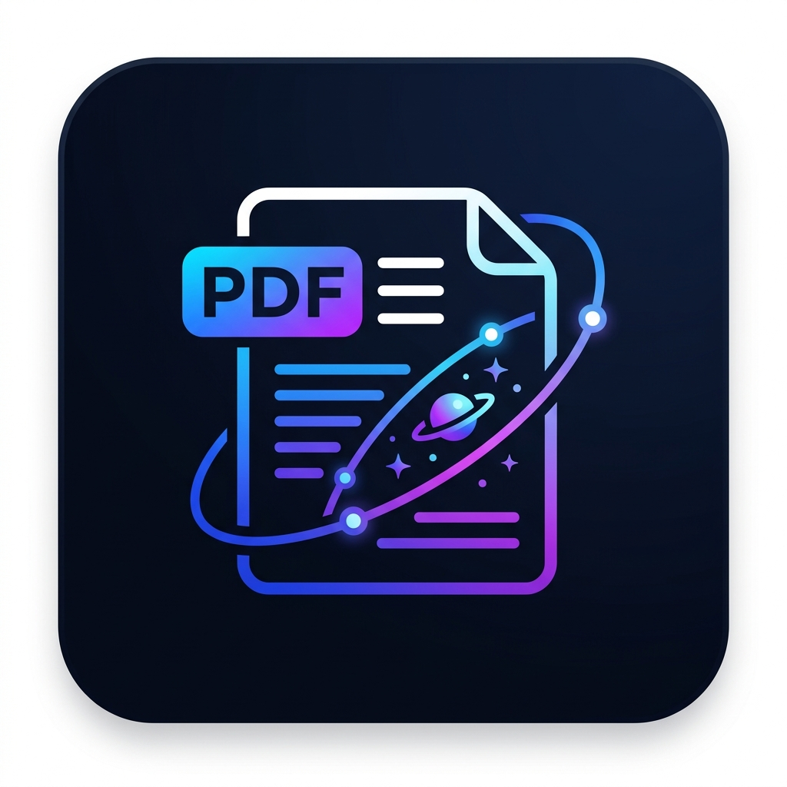

# CosmoNet Reader

<p align="center">
  
</p>

<p align="center">
  <strong>Leggi PDF come si deve. Senza pubblicità.</strong><br/>
  Un lettore PDF professionale per Android e Windows — by <a href="https://www.cosmonet.info">cosmonet.info</a>
</p>

<p align="center">
  
  
  
  
  
</p>

---

## ✨ Caratteristiche

| Funzionalità | Descrizione |
|---|---|
| 📖 **Visualizzazione PDF** | Rendering fluido con pdfrx (motore PDFium) |
| 🔖 **Segnalibri** | Aggiungi e gestisci segnalibri per ogni documento |
| 🔍 **Ricerca nel testo** | Trova istantaneamente qualsiasi parola nel PDF |
| ✏️ **Annotazioni** | Evidenzia e aggiungi note direttamente sul documento |
| 🗂️ **Miniature pagine** | Naviga visivamente tra le pagine |
| 📋 **Indice documenti** | Accedi al sommario del PDF in un click |
| ⌨️ **Scorciatoie tastiera** | Navigazione completa da tastiera su Windows |
| ⚙️ **Impostazioni persistenti** | Preferenze salvate tra una sessione e l'altra |
| 🚫 **100% Offline** | Nessuna API esterna, nessun account, nessun tracking |

---

## 📥 Download

Scarica l'ultima versione dalla pagina **[Releases](https://github.com/CosmoNetinfo/cosmoreader/releases/latest)**:

| Piattaforma | File | Note |
|---|---|---|
| **Android** | `app-arm64-v8a-release.apk` | Per dispositivi moderni (ARM64) |
| **Android** | `app-armeabi-v7a-release.apk` | Per dispositivi più datati (ARM) |
| **Windows** | `CosmoNetReader_*_Setup.exe` | Installer guidato per Windows 10/11 |

### Installazione Android (sideload)
1. Abilita **Origini sconosciute** in *Impostazioni → Sicurezza*
2. Scarica l'APK e aprilo
3. Segui le istruzioni di installazione

---

## 🛠️ Build locale

### Requisiti
- Flutter `>=3.41.0` (Dart `>=3.11.0`)
- Android SDK (per build Android)
- Visual Studio 2022 con workload *Desktop development with C++* (per build Windows)
- [Inno Setup 6](https://jrsoftware.org/isinfo.php) (per generare l'installer `.exe`)

### Comandi

```bash
# Installa dipendenze
flutter pub get

# Build Android (APK split per architettura)
flutter build apk --release --split-per-abi

# Build Windows
flutter build windows --release

# Genera installer Windows
iscc installer.iss
```

---

## 🚀 CI/CD

Il progetto usa **GitHub Actions** per compilare e rilasciare automaticamente.
La pipeline si attiva creando un tag:

```bash
git tag v2.0.1
git push origin v2.0.1
```

Il workflow `.github/workflows/build.yml` produce:
1. APK Android (split per ABI)
2. Setup Windows `.exe` (via Inno Setup)
3. GitHub Release con tutti i file allegati

---

## 🏗️ Architettura

```
lib/
├── main.dart                  # Entry point
├── app.dart                   # MaterialApp e routing
├── models/                    # Modelli dati
│   ├── recent_file.dart
│   ├── bookmark.dart
│   ├── annotation.dart
│   └── pdf_document_info.dart
├── services/                  # Logica di business
│   ├── database_service.dart  # SQLite (sqflite)
│   ├── recent_files_service.dart
│   ├── reading_state_service.dart
│   ├── bookmark_service.dart
│   ├── annotation_service.dart
│   └── search_service.dart
├── screens/                   # Schermate
│   ├── home_screen.dart       # Layout responsive (desktop + mobile)
│   ├── pdf_viewer_screen.dart # Visualizzatore PDF
│   └── settings_screen.dart  # Impostazioni
├── widgets/                   # Widget riutilizzabili
│   ├── recent_file_card.dart
│   ├── empty_state.dart
│   └── viewer/
│       ├── viewer_toolbar.dart
│       ├── viewer_bottom_bar.dart
│       ├── bookmarks_panel.dart
│       ├── search_bar_overlay.dart
│       ├── annotation_toolbar.dart
│       ├── thumbnail_drawer.dart
│       ├── document_outline.dart
│       └── document_info_sheet.dart
├── theme/                     # Design system
│   ├── cosmonet_colors.dart   # Palette colori
│   ├── app_theme.dart         # ThemeData
│   └── text_styles.dart       # Tipografia
└── utils/
    └── shortcut_intents.dart  # Scorciatoie tastiera desktop
```

---

## ⌨️ Scorciatoie tastiera (Windows)

| Tasto | Azione |
|---|---|
| `Ctrl+O` | Apri file |
| `←` / `→` | Pagina precedente / successiva |
| `Home` / `End` | Prima / Ultima pagina |
| `Ctrl+F` | Apri ricerca |
| `Esc` | Chiudi pannelli |
| `Ctrl+P` | Stampa |
| `Ctrl+D` | Aggiungi segnalibro |
| `F11` | Schermo intero |
| `Ctrl++` / `Ctrl+-` | Zoom in / out |

---

## 📄 Licenza

Questo progetto è distribuito sotto licenza **MIT**. Vedi [LICENSE](LICENSE) per i dettagli.

---

<p align="center">
  Realizzato con ❤️ da <strong>DanyWolf</strong> — <a href="https://www.cosmonet.info">cosmonet.info</a>
</p>
